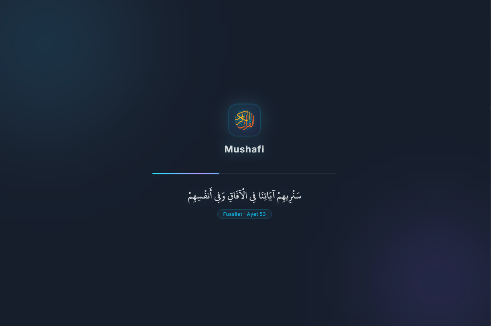
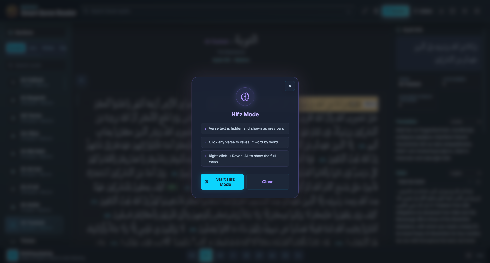
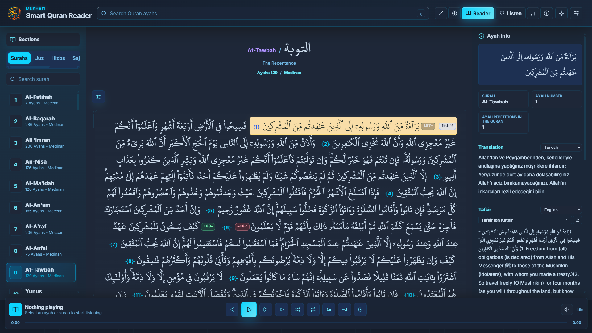
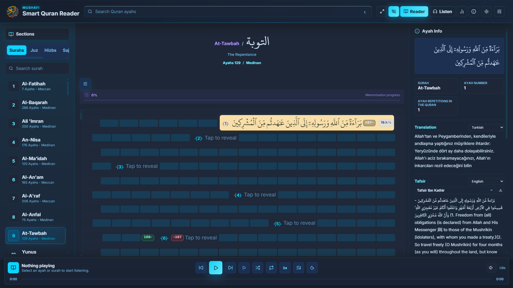
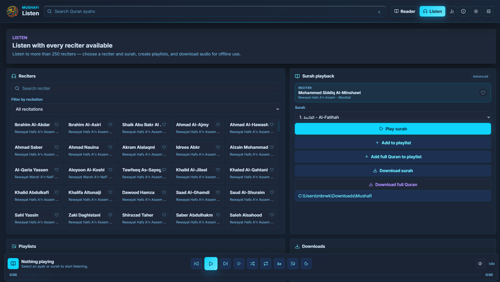
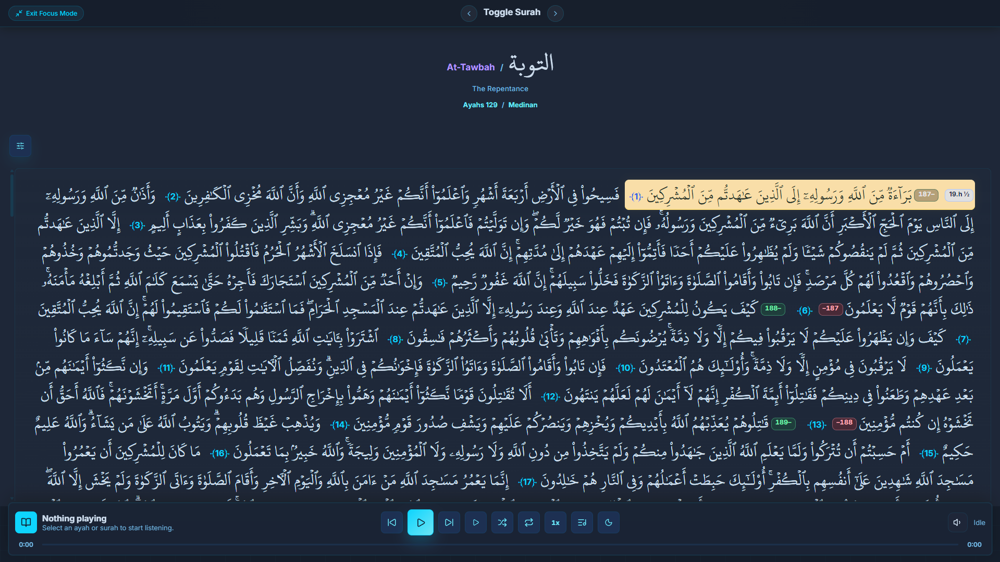
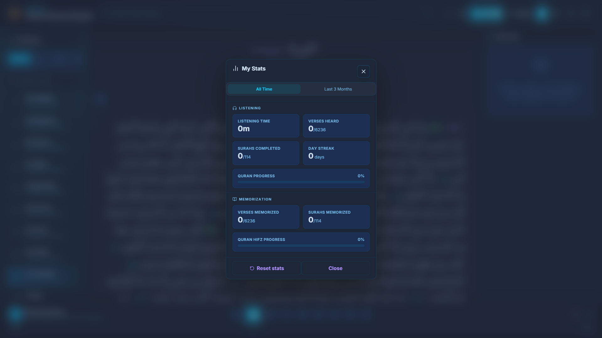
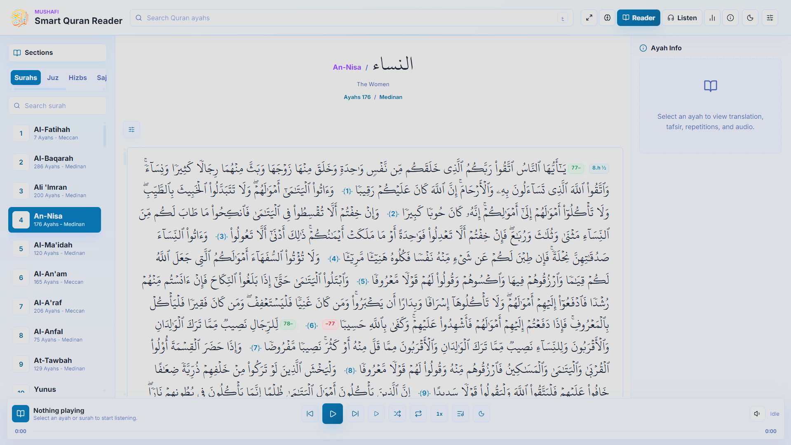

# 📖 Mushafi

### Your Holy Quran Companion

*Read • Listen • Reflect • Memorize*

**[⬇️ Direct Download](https://github.com/Youssef-mohamed-developer/Mushafi/releases) • [🏪 Microsoft Store](https://apps.microsoft.com/detail/9MVWH2THS8S2)**

---

# 🕌 About

**Mushafi** is a free Windows desktop application designed to provide a beautiful and distraction-free Quran experience. Read, listen, memorize, and reflect on the Holy Quran with powerful features, elegant design, and complete privacy.

Once your desired content is downloaded, the application works **fully offline**, with **zero personal data collection**.

---

# ✨ Features

## 📖 Reading

- 📖 Complete Holy Quran with a beautiful Arabic font
- 🔍 Instant search across the entire Quran
- 🎨 Color-coded **Tajweed rules** with explanations
- 🧭 Smart navigation by:
  - Surah
  - Juz'
  - Hizb
  - Quarter Hizb
  - Pages
  - Sajdah verses
- 🔖 Bookmarks to save your reading progress
- 📍 View all occurrences of any selected verse throughout the Quran

---

## 🎧 Listening

- 🎙️ **250+ reciters** with multiple narrations
  - Hafs 'an Asim
  - Warsh 'an Nafi'
  - and more
- ▶️ Play:
  - Entire Surahs
  - Selected verses
  - Pages
  - Hizbs
  - Half Hizbs
  - Quarter Hizbs
  - Individual or multiple Juz'
- 📃 Custom playlists
- ❤️ Favorite reciters
- 🔁 Repeat verses for memorization
- 👁️ Automatic verse highlighting during recitation
- 📥 Download recitations for offline listening
- ⚡ Adjustable playback speed
- 🌙 Sleep timer

---

## 📚 Understanding

- Trusted Tafsir collections including:
  - Al-Muyassar
  - Ibn Kathir
  - As-Sa'di
  - Al-Qurtubi
  - At-Tabari
  - Al-Baghawi
  - Al-Jalalayn
  - and more
- 🌍 Multiple Quran translations
- 📑 Display Tafsir and translation alongside the selected verse

---

## 🧠 Memorization

- 🙈 Memorization Mode that gradually reveals words while testing yourself
- 📊 Reading and listening statistics to help maintain consistency

---

## 🎨 User Experience

- 🌐 Interface available in **14 languages**

  - Arabic
  - English
  - Turkish
  - Urdu
  - Indonesian
  - Bengali
  - Persian
  - French
  - Spanish
  - Russian
  - Swahili
  - Hausa
  - Swedish
  - Chinese

- 🌗 Dark & Light themes
- 🎨 Full color customization
- 🔒 Privacy-focused — no personal data is collected

---

# 📥 Download & Installation

## Option 1 — Direct Download

1. Click **`Mushafi-Setup-x.x.x.exe`** in the repository files.
2. Press the **Download raw file** button.
3. Run the installer.
4. Follow the installation steps.
5. Launch **Mushafi** from your desktop or Start Menu.

> **Note:** If Windows SmartScreen appears, click **More info → Run anyway**. This only happens because the application is new and not yet commercially code-signed.

---

## Option 2 — Microsoft Store

Install with one click and receive automatic updates.

👉 **https://apps.microsoft.com/detail/9MVWH2THS8S2**

---

# 🔄 Updates

Mushafi automatically checks for updates and notifies you whenever a new version is available.

Microsoft Store installations receive updates automatically through the Store.

---

# 🖼️ Screenshots

 

 

 

 

---

# 🛠️ Built With

- ⚛️ Electron
- ⚛️ React
- 🟦 TypeScript
- ⚡ Vite

---

# 🤝 Support

Found a bug or have a feature request?

- Open an **Issue** in this repository.
- If you enjoy Mushafi, don't forget to ⭐ star the project.

Your support and prayers are greatly appreciated.

---

# 📄 License

© 2026 **Youssef Mohamed (SLASHx)**

Mushafi is **completely free** for personal use.

Commercial redistribution or resale is not permitted.

---

*"We ask Allah to make this application a means of helping Muslims read, memorize, understand, and reflect upon His Noble Book."* 🤲

"# Mushafi" 
